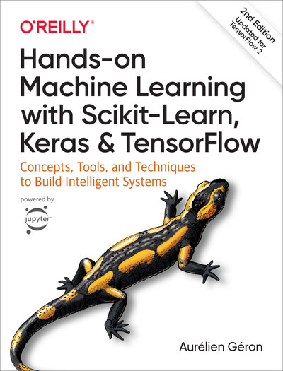

# Machine Learning Interview Questions — Comprehensive Answers

## 1. How is machine learning different from general programming?

Machine learning differs fundamentally from traditional programming in how problems are solved. In general programming, developers write explicit rules and logic to transform inputs into outputs—a deterministic, rule-based approach. Machine learning, by contrast, learns patterns from data rather than following hardcoded instructions. ML systems can adapt and improve as they process more data, handling complex, unstructured inputs like images, text, or audio where explicit rules would be impractical to define. Traditional programming excels at well-defined, rule-based tasks with predictable outputs, while ML thrives in pattern recognition and prediction tasks where the relationship between inputs and outputs is too complex to program manually.[2][3][4][5][6][7]

## 2. What is Overfitting in Machine Learning and how can it be avoided?

Overfitting occurs when a model learns noise and random fluctuations in training data rather than the underlying patterns, resulting in excellent training performance but poor generalization to new data. It can be prevented through several techniques: **early stopping** (halting training when validation performance degrades), **regularization** (L1/L2 penalties that constrain model complexity), **cross-validation** (testing on multiple data subsets), **pruning** (removing unnecessary features or model components), **data augmentation** (expanding training data artificially), and **ensemble methods** (combining multiple models). Using sufficient, diverse training data and selecting appropriate model complexity are also crucial. The key is balancing model complexity with the amount of available training data.[8][9][10][11][12]

## 3. Why do we perform normalization?

Normalization scales features to a common range, typically \$\$ or standardizes them to have mean 0 and standard deviation 1. This prevents features with larger scales from dominating distance-based algorithms like k-nearest neighbors, support vector machines, or neural networks. Normalization accelerates convergence in gradient-based optimization by creating a more uniform loss surface, reducing training time significantly. It also prevents numerical instability issues like vanishing or exploding gradients in deep learning. Additionally, normalized data makes features more comparable and interpretable, ensuring that the learning algorithm treats all features with equal importance initially.[13][14][15][16][17][18]

## 4. What is the difference between precision and recall?

Precision measures the accuracy of positive predictions—the fraction of correctly identified positive instances among all instances predicted as positive. It answers: "Of all items labeled positive, how many are actually positive?" Precision = True Positives / (True Positives + False Positives). Recall (sensitivity) measures the model's ability to find all actual positive instances—the fraction of true positives among all actual positive instances. It answers: "Of all actual positive items, how many did we identify?" Recall = True Positives / (True Positives + False Negatives). There's an inherent tradeoff: increasing recall often decreases precision and vice versa. High precision is crucial when false positives are costly (e.g., spam filtering), while high recall is essential when missing positives is dangerous (e.g., disease diagnosis).[19][20][21][22]

## 5. What is the bias-variance tradeoff?

The bias-variance tradeoff is a fundamental concept describing the balance between two sources of prediction error. **Bias** refers to errors from oversimplified models that fail to capture underlying patterns, leading to underfitting. High bias models consistently make predictions far from actual values. **Variance** refers to errors from overly complex models that fit training data too closely, including noise, leading to overfitting. High variance models produce widely varying predictions across different training sets. As model complexity increases, bias decreases but variance increases. The goal is finding optimal complexity that minimizes total error by balancing both components. Techniques like regularization, cross-validation, and ensemble methods help achieve this balance.[23][24][25][26]

## 6. What is Principal Component Analysis?

Principal Component Analysis (PCA) is a dimensionality reduction technique that transforms high-dimensional data into a lower-dimensional space while preserving maximum variance. PCA identifies principal components—new orthogonal axes that capture the most important patterns in data. It works by computing eigenvectors and eigenvalues from the data's covariance matrix. The first principal component points in the direction of greatest variance, the second component (perpendicular to the first) captures the next highest variance, and so on. PCA standardizes data first, then projects it onto selected principal components, reducing dimensionality while retaining essential information. It's widely used for data visualization, noise reduction, feature extraction, and speeding up machine learning algorithms.[27][28][29][30]

## 7. What is one-shot learning?

One-shot learning is a machine learning paradigm where models learn to recognize objects or patterns from just a single training example (or very few examples). Unlike traditional deep learning requiring thousands of labeled samples, one-shot learning mimics human ability to recognize new concepts quickly from minimal exposure. It typically uses techniques like **metric learning** (learning similarity functions to compare new instances with known examples), **transfer learning** (building on pre-learned representations), or **siamese networks** (learning to assess similarities between pairs of inputs). One-shot learning is particularly valuable in computer vision for facial recognition, object detection, and scenarios where collecting large labeled datasets is impractical or expensive. Applications include signature verification, personalized recommendations, and medical imaging where rare conditions limit available training data.[31][32][33][34][35][36]

## 8. What is the difference between stochastic gradient descent (SGD) and gradient descent (GD)?

Gradient descent (GD), also called batch gradient descent, computes gradients using the entire training dataset before updating model parameters. Stochastic gradient descent (SGD) updates parameters after processing each individual training example (or small batch). **Key differences**: GD is slower but provides accurate, stable gradient estimates leading to smooth convergence. SGD is faster, requires less memory, and updates parameters more frequently, enabling quicker convergence. GD is deterministic (same results for same initial conditions), while SGD is stochastic due to random sample selection. SGD can escape local minima due to its noisy updates and handles large datasets more effectively. However, SGD has less accurate gradient estimates and more erratic convergence paths. In practice, mini-batch gradient descent (using small batches) balances both approaches.[37][38]

## 9. What is the Central Limit Theorem?

The Central Limit Theorem (CLT) states that as sample size increases, the distribution of sample means approaches a normal (bell-shaped) distribution, regardless of the underlying population distribution. For sufficiently large samples (typically n > 30), sample means will be normally distributed even if the original data is skewed or non-normal. The theorem specifies that the sample mean distribution has mean equal to the population mean (μ) and standard deviation equal to σ/√n, where σ is the population standard deviation and n is sample size. This standard deviation of sample means is called the standard error. CLT is foundational in statistics because it enables making inferences about populations using sample data, even when population distribution is unknown. It justifies using normal distribution-based methods in hypothesis testing and confidence interval construction.[39][40][41][42][43]

## 10. Explain the working principle of SVM.

Support Vector Machines (SVM) are supervised learning algorithms that find the optimal hyperplane separating different classes by maximizing the margin between them. The **margin** is the distance from the hyperplane to the nearest data points (support vectors) from each class. SVM identifies the hyperplane that maximizes this margin, ensuring robust class separation. For linearly separable data, SVM finds a "hard margin" with no misclassifications. For non-linearly separable data, SVM uses a "soft margin" allowing some misclassifications while minimizing a penalty term (hinge loss). The objective function balances margin maximization with penalty minimization, controlled by hyperparameter λ. For non-linear problems, SVM applies the **kernel trick**, mapping data to higher dimensions where linear separation becomes possible. SVM is robust to outliers and effective in high-dimensional spaces.[44][45][46][47][48]

## 11. What is the difference between L1 and L2 regularization? What is their significance?

L1 regularization (Lasso) adds the absolute value sum of coefficients as a penalty term to the loss function, while L2 regularization (Ridge) adds the squared sum of coefficients. **Key differences**: L1 can shrink coefficients to exactly zero, effectively performing feature selection and creating sparse models. L2 shrinks coefficients toward zero but rarely to exactly zero, maintaining all features with reduced influence. L1 is less effective with multicollinearity, potentially randomly selecting one correlated feature. L2 handles multicollinearity well by distributing coefficient values among correlated features. **Significance**: L1 improves model interpretability by eliminating irrelevant features, reducing complexity. L2 improves model stability and generalization without removing features entirely. Both prevent overfitting by penalizing model complexity, with the penalty strength controlled by hyperparameter λ.[49][50][51][52]

## 12. What is the purpose of splitting a given dataset into training and validation data?

Splitting data into training and validation sets is essential for building models that generalize well to unseen data. The **training set** is used to fit model parameters and learn patterns. The **validation set** is used during training to tune hyperparameters, select optimal model architectures, and detect overfitting before final evaluation. Using separate sets prevents data leakage—training on data you later evaluate on would produce artificially high accuracy metrics that don't reflect real-world performance. The validation set provides unbiased performance estimates during development, guiding decisions about model complexity, regularization strength, and when to stop training. A **test set** (third split) is reserved for final, unbiased evaluation after all development decisions are made. This three-way split ensures realistic assessment of model generalization capability.[53][54][55][56]

## 13. Why removing highly correlated features are considered a good practice?

Removing highly correlated features is beneficial because they carry redundant information, increasing model complexity without adding predictive value. **Multicollinearity** (high correlation between features) makes it difficult to determine individual feature effects on predictions, reducing model interpretability. It causes numerical instability in algorithms, particularly those relying on matrix inversions. Correlated features can lead to overfitting as models may capture noise in the small differences between highly similar features. Removing redundancy simplifies models, reduces training time, and decreases memory requirements. When features measure the same or similar underlying concepts, keeping only one preserves information while reducing dimensionality. This helps avoid the curse of dimensionality. Typically, when two features have correlation coefficients near ±1, one is removed based on domain knowledge, feature importance scores, or statistical properties.[57][58][59][60]

## 14. Reverse a linked list in place.

To reverse a linked list in place, use three pointers to iteratively reverse the direction of each node's next pointer. Initialize `previous = null`, `current = head`, and `next = null`. Iterate through the list: save the next node (`next = current.next`), reverse the current node's pointer (`current.next = previous`), advance previous and current pointers (`previous = current`, `current = next`). Continue until `current` becomes null. Finally, return `previous` as the new head. This algorithm has O(n) time complexity and O(1) space complexity since it only uses three pointers regardless of list size. The key insight is that you need to save the next node before modifying the current node's pointer, otherwise you lose access to the rest of the list. This is a classic algorithm problem testing pointer manipulation and understanding of linked list data structures.[13]

## 15. What is the reason behind the curse of dimensionality?

The curse of dimensionality refers to various phenomena where algorithm efficiency and effectiveness deteriorate as data dimensionality increases exponentially. As dimensions increase, data points become increasingly sparse—the volume of high-dimensional space grows exponentially while the number of data points remains fixed. This sparsity makes it difficult to identify meaningful patterns or statistical relationships. The amount of data required for statistically sound predictions grows exponentially with dimensions. Distance metrics become less meaningful in high dimensions—all points appear equidistant, breaking distance-based algorithms like k-nearest neighbors. Computational complexity, training time, and memory requirements increase dramatically. The curse increases overfitting risk as models have more parameters to fit with relatively less data per dimension. Solutions include dimensionality reduction (PCA, feature selection), feature engineering, regularization, and collecting more data.[61][62][63][64][65]

## 16. What is Linear Discriminant Analysis?

Linear Discriminant Analysis (LDA) is a supervised technique for classification and dimensionality reduction that finds linear combinations of features that best separate classes. LDA maximizes the ratio of between-class variance to within-class variance, creating decision boundaries that separate classes optimally. **Key assumptions**: data in each class follows a normal distribution, all classes have equal covariance matrices, and classes are linearly separable. LDA projects high-dimensional data onto a lower-dimensional space (typically one less than the number of classes) where class separation is maximized. It differs from PCA: PCA maximizes total variance without considering class labels, while LDA maximizes class separability. LDA is a generalization of Fisher's Linear Discriminant, extending it to handle multiple classes. Applications include face recognition, pattern recognition, medical diagnosis, and preprocessing for other machine learning algorithms.[66][67][68][69]

## 17. Can you explain the differences between supervised, unsupervised, and reinforcement learning?

**Supervised learning** trains on labeled data where input-output pairs are provided, learning to map inputs to known outputs. It solves classification (predicting categories) and regression (predicting continuous values) problems using algorithms like decision trees, SVM, and neural networks. Examples include medical diagnosis, fraud detection, and sentiment analysis. **Unsupervised learning** discovers patterns in unlabeled data without predefined outputs. It performs clustering (grouping similar data) and association (finding relationships) using algorithms like K-means, hierarchical clustering, and PCA. Applications include customer segmentation, anomaly detection, and dimensionality reduction. **Reinforcement learning** trains agents to make sequential decisions by interacting with environments, learning from rewards and penalties rather than labeled examples. It uses trial-and-error with algorithms like Q-learning and Deep Q-Networks to optimize long-term rewards. Applications include robotics, autonomous driving, and game playing.[70][71][72][73][74]

## 18. What are convolutional networks? Where can we use them?

Convolutional Neural Networks (CNNs) are specialized deep learning architectures designed primarily for processing grid-structured data like images. CNNs use convolutional layers that apply learnable filters (kernels) sliding across inputs to automatically extract hierarchical features, mimicking the human visual cortex organization. Unlike fully connected networks, CNNs exploit spatial structure through **local connectivity** (neurons connect only to small regions), **parameter sharing** (same filter used across entire input), and **translation equivariance** (detecting patterns regardless of position). **Applications** include: image classification, object detection and localization (autonomous vehicles, surveillance), semantic segmentation (medical imaging, scene understanding), facial recognition (security systems), medical diagnosis (tumor detection, disease classification), image generation (GANs, style transfer), video analysis, natural language processing, recommendation systems, and financial time series analysis. CNNs require less preprocessing than traditional algorithms as they learn optimal filters automatically.[75][76][77][78][79]

## 19. What is cost function?

A cost function (loss function) is a mathematical formula that quantifies how well a machine learning model performs by measuring the difference between predicted and actual values. It calculates the total error across all predictions, providing a numerical representation of model accuracy. The primary objective during training is to **minimize** the cost function by adjusting model parameters through optimization algorithms like gradient descent. Different cost functions suit different tasks: **Mean Squared Error (MSE)** for regression (calculating average squared differences between predictions and actuals), **Cross-Entropy** for classification (measuring dissimilarity between predicted probabilities and true labels), and **Hinge Loss** for support vector machines. The cost function guides the learning process—its gradient indicates the direction to adjust parameters for improved performance. Lower cost values indicate better model fit, though extremely low training cost may signal overfitting.[80][81][82][83][84]

## 20. List different activation neurons or functions.

Common activation functions include: **ReLU (Rectified Linear Unit)**: $f(x) = \max(0, x)$, most popular for hidden layers, computationally efficient, helps mitigate vanishing gradients but suffers from dying ReLU problem. **Sigmoid**: $f(x) = 1/(1 + e{-x})$, outputs between 0 and 1, used in binary classification output layers, suffers from vanishing gradient problem. **Tanh (Hyperbolic Tangent)**: $f(x) = (ex - e{-x})/(ex + e{-x})$, outputs between -1 and 1, zero-centered making optimization easier than sigmoid. **Leaky ReLU**: $f(x) = \max(\alpha x, x)$ where α is small (e.g., 0.01), addresses dying ReLU problem by allowing small negative values. **Softmax**: $f(x_i) = e{x_i}/\sum e{x_j}$, converts outputs to probability distribution, used in multi-class classification output layers. **ELU (Exponential Linear Unit)**: smooth approximation to ReLU with negative values. **Swish**: $f(x) = x \cdot \text{sigmoid}(x)$, discovered by Google, outperforms ReLU in deep networks. Each function has specific use cases based on problem type and layer position.[76][75]

## 21. Explain Epoch vs. Batch vs. Iteration.

An **epoch** is one complete pass through the entire training dataset—when every training example has been used once to update the model. An **iteration** is a single update of model parameters, typically using one batch of data. A **batch** is a subset of training examples processed together before updating parameters. The relationship: If you have 1,000 training examples and a batch size of 100, one epoch contains 10 iterations (1,000 ÷ 100 = 10 batches). **Batch size** determines the number of samples processed before parameter updates—larger batches provide more accurate gradient estimates but require more memory and computation. Small batches (or single samples in SGD) enable faster, more frequent updates but with noisier gradients. Training typically requires multiple epochs, with the model gradually improving as it sees the data repeatedly. The number of epochs needed depends on dataset size, model complexity, and learning rate.[38][37]

## 22. What is regularization, why do we use it, and give some examples of common methods?

Regularization is a set of techniques that prevent overfitting by adding constraints or penalties to discourage model complexity. It helps models generalize better to unseen data by reducing their capacity to memorize training data noise. **Why use it**: Complex models with many parameters easily overfit training data, performing poorly on new data. Regularization balances model complexity with training accuracy, creating simpler, more robust models. **Common methods**: **L1 regularization (Lasso)** adds absolute value of coefficient magnitudes to the loss function, performing feature selection by shrinking some coefficients to zero. **L2 regularization (Ridge)** adds squared coefficient magnitudes, shrinking all coefficients without eliminating features. **Dropout** randomly deactivates neurons during training, preventing co-adaptation. **Early stopping** halts training when validation performance stops improving. **Data augmentation** artificially expands training data. **Elastic Net** combines L1 and L2 penalties.[51][52][49][76][8]

## 23. Explain why the performance of XGBoost is better than that of SVM?

XGBoost (Extreme Gradient Boosting) often outperforms SVM for several reasons. **Ensemble approach**: XGBoost builds multiple weak learners (decision trees) sequentially, each correcting previous errors, while SVM finds a single optimal hyperplane. This ensemble method captures complex non-linear patterns more effectively. **Handling heterogeneous data**: XGBoost naturally handles mixed feature types (categorical, numerical) and missing values, whereas SVM requires extensive preprocessing and complete data. **Scalability**: XGBoost is optimized for speed with parallel processing and efficient memory usage, handling large datasets better than SVM which has O(n²) to O(n³) complexity. **Feature interactions**: XGBoost automatically captures feature interactions through tree splits, while SVM requires manual kernel selection. **Regularization**: XGBoost includes built-in L1/L2 regularization controlling tree complexity, preventing overfitting. **Interpretability**: XGBoost provides feature importance scores aiding model understanding. **Tuning**: XGBoost offers more hyperparameters for fine-tuning performance. However, SVM excels in high-dimensional spaces with clear margins and smaller datasets.[45][48][70]

## 24. What is the difference between correlation and causality?

**Correlation** measures statistical association between variables—when one variable changes, the other tends to change in a predictable pattern. Correlation coefficients range from -1 to +1, indicating strength and direction of relationships. **Causality** means one variable directly causes changes in another through a causal mechanism. **Key difference**: Correlation does NOT imply causation—two variables can be correlated without one causing the other. Common scenarios creating non-causal correlation: **confounding variables** (third variable influences both, like ice cream sales and drowning rates both increase in summer), **reverse causation** (effect mistaken for cause), **coincidence** (spurious correlation in random data). Establishing causality requires: temporal precedence (cause precedes effect), elimination of alternative explanations, controlled experiments or strong observational evidence, and theoretical mechanism explaining the relationship. Randomized controlled trials are the gold standard for proving causation by controlling confounding factors. In machine learning, predictive models can exploit correlations without understanding causal relationships, but causal inference requires specialized techniques.[20][21][19]

## 25. What is stemming?

Stemming is a text preprocessing technique in natural language processing that reduces words to their root or base form (stem) by removing suffixes and prefixes. For example, "running," "runs," and "ran" all stem to "run." Stemming uses algorithmic rules to chop word endings, creating stems that may not be valid dictionary words. The most common algorithm is the **Porter Stemmer**, which applies a series of rule-based transformations. Other algorithms include Snowball Stemmer and Lancaster Stemmer, each with different aggressiveness levels. **Purpose**: Stemming reduces vocabulary size, treating morphological variants of words as the same token, improving information retrieval and text analysis efficiency. It helps match related words in search queries and document indexing. **Limitations**: Stemming can be crude, producing non-words or incorrectly grouping unrelated words. For example, "university" and "universe" might stem to the same root despite different meanings. Stemming is faster but less accurate than lemmatization, making it suitable for applications prioritizing speed over linguistic accuracy.[13]

## 26. What is Lemmatization?

Lemmatization is a sophisticated text preprocessing technique that reduces words to their dictionary base form (lemma) using vocabulary and morphological analysis. Unlike stemming, lemmatization produces valid words by considering context and part-of-speech. For example, "better" lemmatizes to "good" (adjective), "running" to "run" (verb), and "am/is/are" all to "be." Lemmatization uses linguistic knowledge and dictionaries, often employing tools like WordNet. **Differences from stemming**: Lemmatization produces linguistically correct base forms while stemming uses crude rule-based chopping. Lemmatization considers word context and part-of-speech; stemming doesn't. Lemmatization is slower but more accurate; stemming is faster but less precise. **Example**: "studies" → lemmatization produces "study," stemming might produce "studi." **Applications**: Lemmatization is preferred when linguistic accuracy matters—text classification, sentiment analysis, semantic search, and chatbots. It's essential when word meaning must be preserved. However, for applications like information retrieval where speed matters more than precision, stemming suffices.[13]

## 27. What is Static Memory Allocation?

Static memory allocation is a memory management technique where memory is allocated at compile time before program execution begins. The size, location, and lifetime of statically allocated variables are determined during compilation and remain fixed throughout program execution. **Characteristics**: Memory is allocated from the stack or static data segment, variables have fixed sizes known at compile time, memory is automatically deallocated when variables go out of scope, and allocation/deallocation is faster than dynamic allocation. **Examples**: Global variables, static variables, and fixed-size arrays are statically allocated. **Advantages**: Fast access (no runtime allocation overhead), predictable memory usage, no fragmentation issues, and automatic cleanup. **Disadvantages**: Inflexible size (cannot change at runtime), potential memory waste if overallocated or stack overflow if underestimated, and limited to compile-time known sizes. **Contrast with dynamic allocation**: Dynamic allocation uses heap memory, occurs at runtime with functions like malloc/new, allows flexible sizes based on runtime conditions, but requires manual deallocation and is slower.[13]

## 28. What are some tools used to discover outliers?

**Statistical methods**: **Z-score** (standardized distance from mean; values >3 or <-3 standard deviations are outliers), **Interquartile Range (IQR)** (values below Q1 - 1.5×IQR or above Q3 + 1.5×IQR), **Modified Z-score** using median absolute deviation for robustness. **Visualization techniques**: **Box plots** show quartiles and mark outliers beyond whiskers, **scatter plots** reveal unusual data points, **histograms** show distribution tails. **Distance-based methods**: **K-Nearest Neighbors (KNN)** identifies points far from neighbors, **DBSCAN** clustering marks points not belonging to dense clusters as outliers. **Machine learning approaches**: **Isolation Forest** isolates anomalies using random partitioning, **One-Class SVM** learns normal data boundaries, **Local Outlier Factor (LOF)** compares local density with neighbors, **Autoencoders** identify points with high reconstruction error. **Domain-specific methods**: **Grubbs' test** for normally distributed data, **Cook's distance** for regression influence. **Tools/libraries**: Python's scikit-learn, PyOD, pandas; R's outliers package; visualization tools like Tableau.[58][62][13]

## 29. What are some methods to improve inference time?

**Model optimization**: **Quantization** reduces precision (32-bit to 8-bit integers), decreasing model size and computation. **Pruning** removes unnecessary weights/neurons with minimal accuracy loss. **Knowledge distillation** trains smaller "student" models to mimic larger "teacher" models. **Model compression** combines techniques to reduce size while maintaining performance. **Architecture choices**: Use efficient architectures like MobileNet, EfficientNet, or SqueezeNet designed for speed. Replace complex operations with faster alternatives. **Hardware acceleration**: Use GPUs, TPUs, or specialized AI chips for parallel processing. **Batch processing**: Process multiple inputs simultaneously rather than individually. **Caching**: Store and reuse intermediate computations for repeated inputs. **Early stopping**: Terminate computation when confidence threshold is reached. **Approximate methods**: Use approximate nearest neighbor search instead of exact search. **Preprocessing**: Optimize data pipelines, reduce input resolution where acceptable. **Framework optimization**: Use optimized inference engines like TensorRT, ONNX Runtime, or TensorFlow Lite. **Parallelization**: Distribute computation across multiple cores/devices.[79][75][76][13]
[100][101][102][103][104][105][106][107][108][109][110][111][112][113][114][115][116][117][118][85][86][87][88][89][90][91][92][93][94][95][96][97][98][99]

  

  
<b>🔎 Click to view References</b>

1. <https://insightsoftware.com/blog/machine-learning-vs-traditional-programming/> [↩](#cite1)  
2. <https://www.linkedin.com/pulse/how-machine-learning-different-from-general-programming-zlcuf> [↩](#cite2)  
3. <https://www.geeksforgeeks.org/machine-learning/traditional-programming-vs-machine-learning/> [↩](#cite3)  
4. <https://unp.education/content/how-machine-learning-is-different-from-general-programming/> [↩](#cite4)  
5. <https://sparks.codezela.com/machine-learning-vs-programming/> [↩](#cite5)  
6. <https://www.avenga.com/magazine/machine-learning-programming/> [↩](#cite6)  
7. <https://www.institutedata.com/blog/machine-learning-vs-traditional-programming-choosing-the-right-approach-for-your-projects/> [↩](#cite7)  
8. <https://aws.amazon.com/what-is/overfitting/> [↩](#cite8)  
9. <https://elitedatascience.com/overfitting-in-machine-learning> [↩](#cite9)  
10. <https://developers.google.com/machine-learning/crash-course/overfitting/overfitting> [↩](#cite10)  
11. <https://www.ibm.com/think/topics/overfitting> [↩](#cite11)  
12. <https://www.geeksforgeeks.org/machine-learning/underfitting-and-overfitting-in-machine-learning/> [↩](#cite12)  
13. <https://github.com/loukesio/Machine-Learning> [↩](#cite13)  
14. <https://www.geeksforgeeks.org/machine-learning/what-is-data-normalization/> [↩](#cite14)  
15. <https://www.datacamp.com/tutorial/normalization-in-machine-learning> [↩](#cite15)  
16. <https://developers.google.com/machine-learning/crash-course/numerical-data/normalization> [↩](#cite16)  
17. <https://www.deepchecks.com/glossary/normalization-in-machine-learning/> [↩](#cite17)  
18. <https://en.wikipedia.org/wiki/Normalization_(machine_learning)> [↩](#cite18)  
19. <https://www.deepchecks.com/precision-vs-recall-in-the-quest-for-model-mastery/> [↩](#cite19)  
20. <https://en.wikipedia.org/wiki/Precision_and_recall> [↩](#cite20)  
21. <https://www.evidentlyai.com/classification-metrics/accuracy-precision-recall> [↩](#cite21)  
22. <https://builtin.com/data-science/precision-and-recall> [↩](#cite22)  
23. <https://h2o.ai/wiki/bias-variance-tradeoff/> [↩](#cite23)  
24. <https://uniathena.com/understanding-bias-variance-tradeoff-balance-model-performance> [↩](#cite24)  
25. <https://serokell.io/blog/bias-variance-tradeoff> [↩](#cite25)  
26. <https://www.geeksforgeeks.org/machine-learning/ml-bias-variance-trade-off/> [↩](#cite26)  
27. <https://www.geeksforgeeks.org/data-analysis/principal-component-analysis-pca/> [↩](#cite27)  
28. <https://builtin.com/data-science/step-step-explanation-principal-component-analysis> [↩](#cite28)  
29. <https://en.wikipedia.org/wiki/Principal_component_analysis> [↩](#cite29)  
30. <https://www.ibm.com/think/topics/principal-component-analysis> [↩](#cite30)  
31. <https://www.geeksforgeeks.org/machine-learning/one-shot-learning-in-machine-learning-1/> [↩](#cite31)  
32. <https://encord.com/blog/one-shot-learning-guide/> [↩](#cite32)  
33. <https://toloka.ai/blog/teaching-machines-with-minimal-data-one-shot-learning/> [↩](#cite33)  
34. <https://www.eimt.edu.eu/what-is-one-shot-learning-approach-in-machine-learning> [↩](#cite34)  
35. <https://serokell.io/blog/nn-and-one-shot-learning> [↩](#cite35)  
36. <https://www.dremio.com/wiki/one-shot-learning/> [↩](#cite36)  
37. <https://www.geeksforgeeks.org/machine-learning/difference-between-batch-gradient-descent-and-stochastic-gradient-descent/> [↩](#cite37)  
38. <https://www.geeksforgeeks.org/machine-learning/ml-stochastic-gradient-descent-sgd/> [↩](#cite38)  
39. <https://www.geeksforgeeks.org/maths/central-limit-theorem/> [↩](#cite39)  
40. <https://www.datacamp.com/tutorial/central-limit-theorem> [↩](#cite40)  
41. <https://en.wikipedia.org/wiki/Central_limit_theorem> [↩](#cite41)  
42. <https://www.scribbr.com/statistics/central-limit-theorem/> [↩](#cite42)  
43. <https://statisticsbyjim.com/basics/central-limit-theorem/> [↩](#cite43)  
44. <https://www.coursera.org/articles/svm> [↩](#cite44)  
45. <https://www.geeksforgeeks.org/machine-learning/support-vector-machine-algorithm/> [↩](#cite45)  
46. <https://en.wikipedia.org/wiki/Support_vector_machine> [↩](#cite46)  
47. <https://www.mathworks.com/discovery/support-vector-machine.html> [↩](#cite47)  
48. <https://www.ibm.com/think/topics/support-vector-machine> [↩](#cite48)  
49. <https://builtin.com/data-science/l2-regularization> [↩](#cite49)  
50. <https://wandb.ai/mostafaibrahim17/ml-articles/reports/Understanding-L1-and-L2-regularization-techniques-for-optimized-model-training--Vmlldzo3NzYwNTM5> [↩](#cite50)  
51. <https://www.tutorialspoint.com/difference-between-l1-and-l2-regularization> [↩](#cite51)  
52. <https://neptune.ai/blog/fighting-overfitting-with-l1-or-l2-regularization> [↩](#cite52)  
53. <https://encord.com/blog/train-val-test-split/> [↩](#cite53)  
54. <https://builtin.com/data-science/train-test-split> [↩](#cite54)  
55. <https://mlu-explain.github.io/train-test-validation/> [↩](#cite55)  
56. <https://www.v7labs.com/blog/train-validation-test-set> [↩](#cite56)  
57. <https://www.reddit.com/r/learnmachinelearning/comments/s60y34/how_to_remove_correlating_features/> [↩](#cite57)  
58. <https://www.projectpro.io/recipes/drop-out-highly-correlated-features-in-python> [↩](#cite58)  
59. <https://campus.datacamp.com/courses/dimensionality-reduction-in-python/feature-selection-i-selecting-for-feature-information?ex=13> [↩](#cite59)  
60. <https://www.rohan-paul.com/p/ml-interview-q-series-when-would-ff2> [↩](#cite60)  
61. <https://zilliz.com/glossary/curse-of-dimensionality-in-machine-learning> [↩](#cite61)  
62. <https://www.geeksforgeeks.org/machine-learning/curse-of-dimensionality-in-machine-learning/> [↩](#cite62)  
63. <https://en.wikipedia.org/wiki/Curse_of_dimensionality> [↩](#cite63)  
64. <https://www.datacamp.com/blog/curse-of-dimensionality-machine-learning> [↩](#cite64)  
65. <https://towardsdatascience.com/curse-of-dimensionality-an-intuitive-exploration-1fbf155e1411/> [↩](#cite65)  
66. <https://www.r-bloggers.com/2024/02/understanding-linear-discriminant-analysis-lda/> [↩](#cite66)  
67. <https://www.geeksforgeeks.org/machine-learning/ml-linear-discriminant-analysis/> [↩](#cite67)  
68. <https://en.wikipedia.org/wiki/Linear_discriminant_analysis> [↩](#cite68)  
69. <https://web.stanford.edu/class/stats202/notes/Classification/LDA.html> [↩](#cite69)  
70. <https://www.geeksforgeeks.org/machine-learning/supervised-vs-reinforcement-vs-unsupervised/> [↩](#cite70)  
71. <https://www.aitude.com/supervised-vs-unsupervised-vs-reinforcement/> [↩](#cite71)  
72. <https://www.educative.io/answers/supervised-vs-unsupervised-vs-reinforcement-learning> [↩](#cite72)  
73. <https://www.phdata.io/blog/difference-between-supervised-unsupervised-reinforcement-learning/> [↩](#cite73)  
74. <https://www.ibm.com/think/topics/supervised-vs-unsupervised-learning> [↩](#cite74)  
75. <https://encord.com/blog/convolutional-neural-networks-explained/> [↩](#cite75)  
76. <https://en.wikipedia.org/wiki/Convolutional_neural_network> [↩](#cite76)  
77. <https://www.xenonstack.com/blog/convolutional-neural-network> [↩](#cite77)  
78. <https://www.flatworldsolutions.com/data-science/articles/7-applications-of-convolutional-neural-networks.php> [↩](#cite78)  
79. <https://www.ibm.com/think/topics/convolutional-neural-networks> [↩](#cite79)  
80. <https://www.alooba.com/skills/concepts/machine-learning/cost-functions/> [↩](#cite80)  
81. <https://www.appliedaicourse.com/blog/cost-function-in-machine-learning/> [↩](#cite81)  
82. <https://builtin.com/machine-learning/cost-function> [↩](#cite82)  
83. <https://www.simplilearn.com/tutorials/machine-learning-tutorial/cost-function-in-machine-learning> [↩](#cite83)  
84. <https://www.geeksforgeeks.org/machine-learning/ml-cost-function-in-logistic-regression/> [↩](#cite84)  
85. <https://developers.google.com/machine-learning/crash-course/classification/accuracy-precision-recall> [↩](#cite85)  
86. <https://www.coursera.org/articles/precision-vs-recall-machine-learning> [↩](#cite86)  
87. <https://encord.com/blog/classification-metrics-accuracy-precision-recall/> [↩](#cite87)  
88. <https://scikit-learn.org/stable/auto_examples/model_selection/plot_precision_recall.html> [↩](#cite88)  
89. <https://en.wikipedia.org/wiki/Bias–variance_tradeoff> [↩](#cite89)  
90. <https://www.v7labs.com/blog/precision-vs-recall-guide> [↩](#cite90)  
91. <https://www.cs.cmu.edu/~elaw/papers/pca.pdf> [↩](#cite91)  
92. <https://www.geeksforgeeks.org/machine-learning/precision-and-recall-in-machine-learning/> [↩](#cite92)  
93. <https://sebastianraschka.com/faq/docs/few-shot.html> [↩](#cite93)  
94. <https://en.wikipedia.org/wiki/One-shot_learning_(computer_vision)> [↩](#cite94)  
95. <https://aleksandarhaber.com/easy-to-understand-explanation-of-the-stochastic-gradient-descent-algorithm-with-python-implementation-from-scratch/> [↩](#cite95)  
96. <https://en.wikipedia.org/wiki/Stochastic_gradient_descent> [↩](#cite96)  
97. <https://arxiv.org/abs/2201.08815> [↩](#cite97)  
98. <https://sebastianraschka.com/faq/docs/gradient-optimization.html> [↩](#cite98)  
99. <https://www.miquido.com/ai-glossary/one-shot-learning/> [↩](#cite99)  
100. <https://scikit-learn.org/stable/modules/svm.html> [↩](#cite100)  
101. <https://web.mit.edu/6.034/wwwbob/svm-notes-long-08.pdf> [↩](#cite101)  
102. <https://course.ccs.neu.edu/cs5100f11/resources/jakkula.pdf> [↩](#cite102)  
103. <https://www.reddit.com/r/MachineLearning/comments/dgog2h/d_why_is_l2_preferred_over_l1_regularization/> [↩](#cite103)  
104. <https://www.youtube.com/watch?v=_YPScrckx28> [↩](#cite104)  
105. <https://global.trocco.io/blogs/why-do-you-split-data-into-training-and-validation-sets> [↩](#cite105)  
106. <https://www.techtarget.com/whatis/definition/support-vector-machine-SVM> [↩](#cite106)  
107. <https://www.reddit.com/r/datascience/comments/hx04uf/how_to_remove_correlated_features/> [↩](#cite107)  
108. <https://stackoverflow.com/questions/18270899/remove-highly-correlated-components> [↩](#cite108)  
109. <https://stackoverflow.com/questions/75380186/how-to-drop-one-of-any-two-highly-correlated-features-having-low-correlation-wit> [↩](#cite109)  
110. <https://www.diva-portal.org/smash/get/diva2:1632660/FULLTEXT01.pdf> [↩](#cite110)  
111. <https://www.youtube.com/watch?v=FndwYNcVe0U> [↩](#cite111)  
112. <https://www.youtube.com/watch?v=azXCzI57Yfc> [↩](#cite112)  
113. <https://www.youtube.com/watch?v=ZGbXSVZjES4> [↩](#cite113)  
114. <https://aws.amazon.com/compare/the-difference-between-machine-learning-supervised-and-unsupervised/> [↩](#cite114)  
115. <https://www.youtube.com/watch?v=1FZ0A1QCMWc> [↩](#cite115)  
116. <https://www.pecan.ai/blog/3-types-of-machine-learning/> [↩](#cite116)  
117. <https://www.vervecopilot.com/question-bank/difference-between-supervised-unsupervised-reinforcement-learning> [↩](#cite117)  
118. <https://www.linkedin.com/pulse/demystifying-machine-learning-supervised-unsupervised-bushra-akram> [↩](#cite118)  

# Books 

 
<b>
Hands-On Machine Learning with Scikit-Learn, Keras, and TensorFlow (3rd Edition, 2022) - Comprehensive Chapter Summaries
</b>

### **Chapter 1: The Machine Learning Landscape**

**What the Chapter Talks About:**
This introductory chapter defines machine learning as programming computers to learn from data rather than explicit coding. It covers the main types of ML systems (supervised vs unsupervised, online vs batch, instance-based vs model-based), explains fundamental concepts like training sets, generalization, overfitting/underfitting, and walks through a complete example using linear regression to predict life satisfaction from GDP data. The chapter also discusses the main challenges in ML (insufficient data, poor quality data, irrelevant features, overfitting) and model evaluation strategies.

**Methods and Libraries Used:**

- **Scikit-Learn Core**: `LinearRegression`, `KNeighborsRegressor`
- **Pandas**: `pd.read_csv()` for data loading
- **Matplotlib**: `plot()`, `scatter()` for visualization
- **NumPy**: `.values` for array conversion
- **Model Training**: `.fit()`, `.predict()` methods
- **Data Sources**: OECD Better Life Index, World Bank GDP data

**Why It's Beneficial and When to Use:**

- **Supervised Learning**: Use when you have labeled data; essential for classification (spam detection) and regression (price prediction). Requires less data engineering than unsupervised approaches.
- **Unsupervised Learning**: Use for clustering customers, dimensionality reduction, anomaly detection when labels are expensive or unavailable.
- **Online Learning**: Use when data arrives continuously (stock prices) or when dataset is too large for memory. Enables adaptation to changing patterns without full retraining.
- **Instance-Based (k-NN)**: Simple and effective for small-medium datasets; no training phase required. Use when similar instances should have similar predictions.
- **Model-Based (Linear Regression)**: Use when you want interpretable models and can define performance measures. The Normal equation provides closed-form solution for optimal parameters.
- **When to Use**: This chapter provides decision frameworks for all ML projects—understanding bias/variance tradeoff, train/validation/test splits, and cross-validation prevents common mistakes.

***

### **Chapter 2: End-to-End Machine Learning Project**

**What the Chapter Talks About:**
This chapter walks through a complete ML workflow using the California Housing dataset. It covers the entire pipeline: framing the problem, getting and exploring data, data visualization, train/test splitting with stratified sampling, data cleaning (handling missing values), feature engineering (creating ratio features, cluster similarity features), feature scaling, building transformation pipelines, model selection (Linear Regression, Decision Trees, Random Forests), cross-validation, hyperparameter tuning with GridSearchCV and RandomizedSearchCV, evaluating on test set with confidence intervals, and deploying to production.

**Methods and Libraries Used:**

- **Data Loading**: `pd.read_csv()`, `tarfile` for extraction
- **Visualization**: `DataFrame.plot()`, `scatter()`, `hist()`, correlation matrices with `pd.plotting.scatter_matrix()`
- **Data Splitting**: `train_test_split()`, `StratifiedShuffleSplit`
- **Preprocessing**: `SimpleImputer`, `OrdinalEncoder`, `OneHotEncoder`, `StandardScaler`
- **Feature Engineering**: `FunctionTransformer`, custom transformers (`BaseEstimator`, `TransformerMixin`), `KBinsDiscretizer` for binning, `KMeans` for cluster features
- **Pipelines**: `Pipeline`, `ColumnTransformer`, `make_pipeline()`, `make_column_transformer()`
- **Models**: `LinearRegression`, `DecisionTreeRegressor`, `RandomForestRegressor`, `SVR`
- **Evaluation**: `cross_val_score()`, `mean_squared_error()`, `scipy.stats.t.interval()` for confidence intervals
- **Hyperparameter Tuning**: `GridSearchCV`, `RandomizedSearchCV`
- **Deployment**: `joblib.dump()`, `joblib.load()`, Google Vertex AI

**Why It's Beneficial and When to Use:**

- **Stratified Sampling**: Ensures test set is representative; use when certain features (like income categories) are critical to model performance. Prevents sampling bias.
- **Data Visualization**: Scatterplots with geographic data reveal spatial patterns; use `alpha=0.1` to see density. Correlation matrices identify strong predictors early.
- **Feature Engineering**: Creating ratios (bedrooms_per_room, people_per_household) often improves performance more than algorithm selection. Cluster similarity features capture location patterns better than raw lat/long.
- **Pipelines**: Automate preprocessing to prevent data leakage; ensures same transformations during training and inference. Use `ColumnTransformer` when features need different preprocessing.
- **SimpleImputer**: Handles missing data with strategies (mean, median, most_frequent); use median for skewed distributions. Essential before feeding to algorithms that don't handle NaN.
- **OneHotEncoder**: Converts categorical variables to binary vectors; use with `handle_unknown="ignore"` for robustness to new categories in production.
- **StandardScaler**: Normalizes features to same scale; critical for gradient-based algorithms (Linear/Logistic Regression, SVMs, Neural Networks). Less important for tree-based models.
- **Cross-Validation**: Provides robust performance estimates; use `cv=10` for k-fold. Reveals overfitting when training score >> validation score.
- **GridSearchCV vs RandomizedSearchCV**: Grid search exhaustive but expensive; use for final tuning with small search space. Random search more efficient for large hyperparameter spaces.
- **When to Use**: This workflow applies to any supervised learning project. The pipeline pattern is production-ready and prevents common errors like data leakage.

***

### **Chapter 3: Classification**

**What the Chapter Talks About:**
This chapter focuses on classification using the MNIST handwritten digit dataset. It starts with binary classification (detecting 5s), then covers performance metrics (accuracy, confusion matrix, precision, recall, F1-score, ROC curves, AUC), multiclass classification (softmax/OvR/OvO strategies), multilabel classification, and multioutput classification (removing noise from images). The chapter emphasizes that accuracy is misleading for imbalanced datasets and teaches how to select appropriate metrics and decision thresholds.

**Methods and Libraries Used:**

- **Dataset**: `fetch_openml("mnist_784")` from Scikit-Learn
- **Binary Classifiers**: `SGDClassifier` (Stochastic Gradient Descent), `DummyClassifier` for baselines
- **Performance Metrics**: `confusion_matrix`, `precision_score`, `recall_score`, `f1_score`, `precision_recall_curve`, `roc_curve`, `roc_auc_score`, `ConfusionMatrixDisplay`
- **Cross-Validation**: `cross_val_score()`, `cross_val_predict()`, `StratifiedKFold`
- **Multiclass**: `RandomForestClassifier`, `SVC`, `OneVsRestClassifier`, `OneVsOneClassifier`
- **Multilabel**: `KNeighborsClassifier`
- **Multioutput**: `KNeighborsClassifier` for image denoising
- **Visualization**: `plt.imshow()`, confusion matrix heatmaps
- **Data Augmentation**: `scipy.ndimage.interpolation.shift()` for generating rotated/shifted images

**Why It's Beneficial and When to Use:**

- **SGDClassifier**: Handles large datasets efficiently; trains one instance at a time. Use for online learning and when dataset doesn't fit in memory. Fast but may need careful learning rate tuning.
- **Confusion Matrix**: Reveals which classes are confused; better than accuracy alone. Normalize by row to see error rates per class, by column to see false positive rates.
- **Precision vs Recall Tradeoff**: High precision (few false positives) for applications where false alarms are costly (spam filter flagging legitimate email). High recall (few false negatives) when missing positives is dangerous (cancer detection). Adjust decision threshold using `decision_function()`.
- **F1-Score**: Harmonic mean of precision/recall; use when you want single metric balancing both. Favors classifiers with similar precision and recall.
- **ROC Curve \& AUC**: Compare classifiers regardless of threshold; AUC of 1.0 is perfect. Use ROC when classes are balanced, PR curve when positive class is rare.
- **cross_val_predict()**: Gets predictions for each instance using cross-validation; essential for computing metrics on clean out-of-sample predictions.
- **Multiclass Strategies**: OvR (One-vs-Rest) trains N classifiers; use with algorithms like SVM. OvO trains N(N-1)/2 classifiers; slower but sometimes more accurate. Softmax (multinomial logistic) directly outputs probabilities for all classes; use with neural networks.
- **Multilabel Classification**: Use when instances can belong to multiple classes (tagging photos with multiple people). Evaluate with `average="weighted"` or `average="macro"`.
- **Data Augmentation**: Artificially expand training set by creating slightly modified copies (shifted, rotated, scaled images). Improves generalization especially with small datasets.
- **When to Use**: Classification metrics critical for any classification project. SGD perfect for large-scale text classification or when data streams continuously.

***

### **Chapter 4: Training Models**

**What the Chapter Talks About:**
This chapter dives into how ML algorithms actually work internally. It explains Linear Regression (Normal Equation and Gradient Descent variants: Batch, Stochastic, Mini-Batch), Polynomial Regression for nonlinear data, learning curves for detecting overfitting/underfitting, and regularization techniques (Ridge/Lasso/Elastic Net). It also covers Logistic Regression for binary classification and Softmax Regression for multiclass problems, explaining the math behind gradient computation and parameter optimization.

**Methods and Libraries Used:**

- **Linear Models**: `LinearRegression`, `Ridge`, `Lasso`, `ElasticNet`, `SGDRegressor`
- **Optimization**: Normal equation (`np.linalg.lstsq`, `np.linalg.pinv`), manual gradient descent implementation
- **Polynomial Features**: `PolynomialFeatures` for feature engineering
- **Learning Curves**: `learning_curve()` from `sklearn.model_selection`
- **Classification**: `LogisticRegression`, `SGDClassifier` with log loss, Softmax Regression
- **Mathematical Operations**: NumPy for matrix operations (`@`, `.T`, `np.linalg.inv`)
- **Regularization**: L1 (Lasso), L2 (Ridge), Elastic Net (L1 + L2)

**Why It's Beneficial and When to Use:**

- **Normal Equation**: Computes optimal parameters in one step: $\hat{\theta} = (XT X){-1} XT y$; use for small datasets (<10K instances) when features aren't too numerous. No hyperparameters to tune. Doesn't scale to large datasets (O(n²·m) complexity).
- **Batch Gradient Descent**: Computes gradient using entire training set; slow but converges to global minimum for convex functions. Use with small-medium datasets. Requires feature scaling.
- **Stochastic Gradient Descent (SGD)**: Updates parameters after each instance; very fast but erratic convergence. Use for large datasets (millions of instances) and online learning. Set learning rate schedule to converge.
- **Mini-Batch GD**: Compromise between batch and SGD; updates after small batches (32-256 instances). Use for large datasets with GPU acceleration. Most common in deep learning.
- **Learning Rate**: Critical hyperparameter; too large causes divergence, too small slows convergence. Use grid search or learning rate schedulers. Typical values: 0.001-0.1.
- **Polynomial Regression**: Fits nonlinear relationships by creating polynomial features; use `PolynomialFeatures(degree=d)`. Risk of overfitting with high degrees—use regularization.
- **Learning Curves**: Plot training/validation error vs dataset size; reveals whether model suffers from high bias (underfitting—both curves plateau high) or high variance (overfitting—large gap between curves).
- **Ridge Regression (L2)**: Adds $\alpha \sum \theta_i2$ to cost; keeps all features but shrinks weights. Use when all features potentially useful. Less feature selection than Lasso.
- **Lasso Regression (L1)**: Adds $\alpha \sum |\theta_i|$ to cost; drives some weights to exactly zero (automatic feature selection). Use for high-dimensional data with many irrelevant features.
- **Elastic Net**: Combines L1 and L2; controlled by `l1_ratio`. Use as default over pure Lasso (more stable). Generally preferred over Ridge when feature selection needed.
- **Logistic Regression**: Estimates class probabilities using sigmoid function; outputs values in. Use for binary classification. Can be extended to multiclass with OvR.[2]
- **Softmax Regression**: Generalizes logistic regression to K classes; outputs probability distribution over all classes. Use for mutually exclusive multiclass problems.
- **When to Use**: Understanding gradient descent essential for deep learning. Regularization crucial for models with many features. Learning curves guide model selection and complexity.

***

### **Chapter 5: Support Vector Machines**

**What the Chapter Talks About:**
This chapter covers Support Vector Machines, powerful models for classification and regression that work by finding the maximum margin decision boundary. It explains linear SVM classification (hard and soft margin), the kernel trick for nonlinear problems (polynomial and RBF kernels), SVM regression (SVR), and the mathematical foundations including the dual problem and how support vectors define the decision boundary.

**Methods and Libraries Used:**

- **Linear SVM**: `LinearSVC`, `SVC(kernel="linear")`, `SGDClassifier(loss="hinge")`
- **Nonlinear SVM**: `SVC(kernel="poly")`, `SVC(kernel="rbf")`, `SVC(kernel="sigmoid")`
- **SVM Regression**: `LinearSVR`, `SVR`
- **Preprocessing**: `StandardScaler` (critical for SVMs)
- **Pipeline**: Combining scaling and SVM
- **Hyperparameters**: `C` (regularization), `gamma` (RBF kernel width), `degree` (polynomial kernel)
- **Kernel Functions**: Polynomial, Radial Basis Function (Gaussian), Sigmoid

**Why It's Beneficial and When to Use:**

- **Large Margin Classification**: SVMs find the widest "street" separating classes, maximizing distance to nearest instances (support vectors). Results in better generalization than models that just minimize training error.
- **Support Vectors**: Only instances on margin boundary affect decision boundary; removing other instances doesn't change model. Makes SVMs memory-efficient during prediction.
- **Soft Margin (C parameter)**: Controls margin width vs margin violations tradeoff. Large C = narrow margin, fewer violations (risk overfitting). Small C = wider margin, more violations (better generalization). Tune with cross-validation; typical range: 0.1-100.
- **Feature Scaling**: Critical for SVMs since distance-based. Always use `StandardScaler` before SVM training. Without scaling, features with large ranges dominate.
- **Kernel Trick**: Enables nonlinear classification without explicitly computing high-dimensional transformations. Computes dot products efficiently in feature space.
- **Polynomial Kernel**: Use for problems where feature interactions important; `degree=3` good starting point. `coef0` controls influence of low vs high-degree polynomials.
- **RBF (Gaussian) Kernel**: Most popular kernel; acts like similarity measure to landmarks. Small `gamma` (e.g., 0.1) = smooth decision boundary. Large `gamma` (e.g., 10) = tight around instances (risk overfitting). Use as default for nonlinear problems.
- **SVM Regression (SVR)**: Fits data within ε-tube; tries to fit as many instances as possible inside tube while limiting margin violations. Use `SVR(kernel="rbf")` for nonlinear regression. `epsilon` controls tube width.
- **Computational Complexity**: Training time O(m² · n) to O(m³ · n); doesn't scale to very large datasets (>100K instances). Use `LinearSVC` or `SGDClassifier` for large datasets.
- **When to Use**: Small-medium datasets (hundreds to thousands of instances) with complex, nonlinear decision boundaries. Computer vision (before deep learning era), text classification, bioinformatics. Not ideal for very large datasets or when interpretability crucial.

***

### **Chapter 10: Introduction to Artificial Neural Networks with Keras**

**What the Chapter Talks About:**
This chapter introduces deep learning with Keras. It covers the biological inspiration for neural networks, the perceptron, multilayer perceptrons (MLPs), activation functions (ReLU, sigmoid, softmax), Keras's Sequential and Functional APIs, building classification and regression models, using callbacks (ModelCheckpoint, EarlyStopping, TensorBoard), hyperparameter tuning with Keras Tuner, and saving/loading models. It uses Fashion MNIST for hands-on examples.

**Methods and Libraries Used:**

- **Keras Models**: `Sequential`, `Functional API`, `Subclassing API`
- **Layers**: `Dense`, `Flatten`, `Dropout`, `BatchNormalization`, `Input`
- **Activations**: `activation="relu"`, `"sigmoid"`, `"softmax"`, `"tanh"`, `"selu"`
- **Optimizers**: `optimizer="sgd"`, `"adam"`, `"nadam"`, `SGD(learning_rate=0.01, momentum=0.9)`
- **Loss Functions**: `"sparse_categorical_crossentropy"`, `"categorical_crossentropy"`, `"binary_crossentropy"`, `"mse"`, `"huber"`
- **Metrics**: `metrics=["accuracy"]`, `"mae"`, custom metrics
- **Callbacks**: `ModelCheckpoint`, `EarlyStopping`, `TensorBoard`, `ReduceLROnPlateau`, `LearningRateScheduler`
- **Datasets**: `tf.keras.datasets.fashion_mnist`, `tf.keras.datasets.mnist`
- **Hyperparameter Tuning**: Keras Tuner (`RandomSearch`, `BayesianOptimization`, `Hyperband`)
- **Saving/Loading**: `model.save()`, `tf.keras.models.load_model()`, `model.save_weights()`, `model.load_weights()`

**Why It's Beneficial and When to Use:**

- **Sequential API**: Simplest way to build linear stack of layers; use for 90% of models. Just list layers in order. Example: `Sequential([Flatten(), Dense(300, activation="relu"), Dense(10, activation="softmax")])`.
- **ReLU Activation**: Default activation for hidden layers; solves vanishing gradient problem. Computationally efficient (just max(0, z)). Use in all hidden layers unless specific reason not to.
- **Softmax Output**: Use for multiclass classification; outputs probability distribution summing to 1. Pair with `sparse_categorical_crossentropy` loss (for integer labels) or `categorical_crossentropy` (for one-hot labels).
- **Fashion MNIST**: More challenging than MNIST (28×28 grayscale images of clothing); good benchmark for comparing architectures. Linear model gets ~83% accuracy, simple MLP gets ~89%.
- **model.compile()**: Configures learning process; must specify loss, optimizer, and metrics before training. Loss defines what to minimize; metrics are for human evaluation only.
- **model.fit()**: Trains model; key arguments: `epochs` (passes through dataset), `validation_data` (for monitoring overfitting), `batch_size` (default 32). Returns History object with training metrics.
- **ModelCheckpoint**: Saves best model during training; use `save_best_only=True` to keep only model with best validation performance. Prevents losing good model if training degrades.
- **EarlyStopping**: Stops training when validation performance stops improving; use `patience=10` to wait 10 epochs before stopping. Prevents overfitting and saves training time.
- **TensorBoard**: Visualizes training curves, model graph, profiling; use `TensorBoard(log_dir=...)` callback. Launch with `tensorboard --logdir=logs`. Essential for debugging training.
- **Keras Tuner**: Automates hyperparameter search; more sophisticated than GridSearchCV. `Hyperband` efficient for neural networks. Searches over architecture (layers, units) and training hyperparameters (learning rate).
- **Functional API**: More flexible than Sequential; allows multiple inputs/outputs, branching, sharing layers. Use when model has complex topology (e.g., ResNet skip connections).
- **Regression with MLPs**: Use no activation (or ReLU for positive outputs) in output layer; use MSE or Huber loss. Huber loss robust to outliers (quadratic for small errors, linear for large).
- **When to Use**: Keras is the standard for prototyping neural networks. Use Sequential API for simple models, Functional for complex architectures. MLPs work well for tabular data when feature engineered properly. For images, use CNNs (Chapter 14); for sequences, use RNNs/Transformers (Chapters 15-16).

***

### **Chapter 13: Loading and Preprocessing Data with TensorFlow**

**What the Chapter Talks About:**
This chapter focuses on building efficient data pipelines using the `tf.data` API. It covers creating datasets from various sources (in-memory, files, TFRecord), transforming datasets (map, filter, batch, shuffle, prefetch, cache), handling large datasets that don't fit in memory, preprocessing with TensorFlow (normalization, encoding), using preprocessing layers within models, and integrating with TensorFlow Datasets (TFDS) for accessing popular datasets.

**Methods and Libraries Used:**

- **tf.data API**: `tf.data.Dataset.from_tensor_slices()`, `.from_generator()`, `.list_files()`, `.interleave()`, `.skip()`, `.take()`
- **Transformations**: `.map()`, `.filter()`, `.batch()`, `.shuffle()`, `.prefetch()`, `.cache()`, `.repeat()`, `.window()`
- **TFRecord**: `tf.train.Example`, `tf.train.Feature`, `tf.io.TFRecordWriter`, `tf.data.TFRecordDataset`, `tf.io.parse_single_example()`, `tf.io.FixedLenFeature`, `tf.io.VarLenFeature`
- **Preprocessing Layers**: `tf.keras.layers.Normalization`, `TextVectorization`, `CategoryEncoding`, `Discretization`, `StringLookup`, `IntegerLookup`, `Hashing`
- **Image Preprocessing**: `tf.keras.preprocessing.image.ImageDataGenerator`, `tf.keras.utils.image_dataset_from_directory()`
- **TFDS**: `tfds.load()`, automatic downloading and caching
- **Profiling**: `tf.data.experimental.AUTOTUNE`, TensorBoard profiling

**Why It's Beneficial and When to Use:**

- **tf.data.Dataset**: Efficient data loading abstraction; lazy evaluation, pipelining, and prefetching maximize GPU utilization. Use for any TensorFlow project; superior to feeding NumPy arrays.
- **Prefetching**: Loads next batch while GPU processes current batch; eliminates CPU as bottleneck. Always add `.prefetch(1)` at end of pipeline. Use `tf.data.AUTOTUNE` to automatically optimize buffer size.
- **Shuffling**: Randomizes training order; critical for SGD convergence. Use `buffer_size=10000` or larger. Shuffle before batching. Set `reshuffle_each_iteration=True` to reshuffle every epoch.
- **Caching**: Stores dataset in memory (or disk) after first epoch; speeds up repeated iterations. Use `.cache()` after expensive preprocessing. Only cache if dataset fits in RAM.
- **Batching**: Groups instances for vectorized operations; essential for GPU efficiency. Typical batch sizes: 32-256. Use `.padded_batch()` for variable-length sequences.
- **Mapping (map)**: Applies transformation to each element; use for preprocessing (normalization, augmentation). Set `num_parallel_calls=tf.data.AUTOTUNE` for parallel processing.
- **Interleaving**: Reads from multiple files in parallel; speeds up data loading from sharded datasets. Use `.interleave(cycle_length=5, num_parallel_calls=AUTOTUNE)` for parallel file reading.
- **TFRecord**: TensorFlow's binary format; efficient for large datasets. Protocol Buffer based. Use for datasets >1GB or when loading speed critical. Compress with GZIP for smaller files (slower read).
- **Preprocessing Layers**: Keras layers for data transformation; can be included in model for end-to-end deployment. `Normalization` adapts to data statistics. `TextVectorization` tokenizes and converts text to integers.
- **TFDS (TensorFlow Datasets)**: Provides 200+ ready-to-use datasets; handles downloading, caching, splitting. Use `as_supervised=True` to get (features, labels) tuples. Supports `split="train[:90%]"` for custom splits.
- **ImageDataGenerator**: Legacy API for image augmentation (rotation, zoom, flip); use `preprocessing.image.ImageDataGenerator()`. Newer approach: use Keras preprocessing layers (Chapter 14).
- **When to Use**: Essential for production ML systems. Use tf.data pipeline for any dataset that doesn't fit in memory. TFRecord format for large-scale training. TFDS for quick experimentation with standard datasets. Proper data pipeline can speed up training 10x or more.

***

### **Chapter 14: Deep Computer Vision Using Convolutional Neural Networks**

**What the Chapter Talks About:**
This chapter covers CNNs, the dominant architecture for computer vision. It explains the biological inspiration from the visual cortex, convolutional layers (filters, feature maps, stride, padding), pooling layers, CNN architectures (LeNet-5, AlexNet, GoogLeNet/Inception, VGGNet, ResNet, Xception, SENet, DenseNet, EfficientNet, MobileNet), transfer learning, data augmentation, object detection (YOLO, SSD, Faster R-CNN), semantic segmentation, and using pretrained models from `tf.keras.applications`.

**Methods and Libraries Used:**

- **CNN Layers**: `Conv2D`, `MaxPooling2D`, `AveragePooling2D`, `GlobalAveragePooling2D`, `SeparableConv2D`, `DepthwiseConv2D`
- **Advanced Layers**: `BatchNormalization`, `Dropout`, `ZeroPadding2D`, `Flatten`
- **Architectures**: `tf.keras.applications.ResNet50`, `VGG16`, `InceptionV3`, `MobileNetV2`, `EfficientNetB0`, `DenseNet121`, `Xception`
- **Transfer Learning**: `include_top=False`, `weights="imagenet"`, freezing layers, fine-tuning
- **Data Augmentation**: `RandomFlip`, `RandomRotation`, `RandomZoom`, `RandomContrast`, `RandomTranslation`, `ImageDataGenerator` (legacy)
- **Preprocessing**: `tf.keras.applications.resnet50.preprocess_input()` (model-specific)
- **Object Detection**: `tf.keras.applications.EfficientDet`, custom implementations
- **Semantic Segmentation**: U-Net architecture, FCN (Fully Convolutional Networks)
- **Visualization**: `tf.keras.utils.plot_model()`, activation maximization, Grad-CAM

**Why It's Beneficial and When to Use:**

- **Convolutional Layers**: Detect local patterns (edges, textures) using small filters; parameters shared across spatial locations (weight sharing = fewer parameters). Use for any spatial data (images, audio spectrograms, time series with spatial structure).
- **Filters/Kernels**: Small matrices (typically 3×3 or 5×5) that slide over input; learn to detect features. Early layers detect simple patterns (edges), deeper layers detect complex patterns (faces, objects). Number of filters = number of feature maps.
- **Stride \& Padding**: Stride controls output size (stride=2 downsamples by half). Padding="same" maintains spatial dimensions (adds zeros around borders). Padding="valid" no padding (output smaller).
- **Pooling Layers**: Downsample feature maps; reduce computational cost and provide translation invariance. MaxPooling keeps strongest activations. Use 2×2 pooling with stride=2 to halve dimensions.
- **CNN Architecture Pattern**: Input → [Conv → ReLU → Pool] × N → Flatten → Dense × M → Softmax. Stack multiple conv layers before pooling to learn more complex patterns.
- **Transfer Learning**: Use pretrained models trained on ImageNet (1.4M images, 1000 classes); extract features or fine-tune. Dramatically reduces training data requirements. Use `include_top=False` to remove classification head, add custom layers for your task.
- **Fine-Tuning Strategy**: 1) Freeze all pretrained layers, train only new layers. 2) Unfreeze top layers, fine-tune with very low learning rate (0.0001). Use when you have moderate amount of data (thousands of images).
- **Data Augmentation**: Artificially expand training set by applying random transformations (flip, rotate, zoom, crop, brightness, contrast). Reduces overfitting significantly. Apply during training only, not validation/test.
- **Batch Normalization**: Normalizes inputs to each layer; stabilizes training, enables higher learning rates, acts as regularizer. Place after Conv/Dense layers, before activation (or after, both work).
- **ResNet (Residual Networks)**: Introduces skip connections that add layer input to output; solves vanishing gradient problem in very deep networks (50-152 layers). Use ResNet50/ResNet101 as default for image classification.
- **Inception Modules**: Parallel convolutions with different kernel sizes (1×1, 3×3, 5×5); captures patterns at multiple scales. More computationally efficient than naive multi-scale approach.
- **EfficientNet**: Systematically scales network depth, width, and resolution; achieves state-of-the-art accuracy with fewer parameters. Use EfficientNetB0-B7 depending on computational budget.
- **MobileNet**: Optimized for mobile/edge devices using depthwise separable convolutions; 10x fewer parameters than standard CNNs with minimal accuracy loss. Use when deploying to mobile devices or when inference speed critical.
- **Semantic Segmentation**: Pixel-wise classification; outputs class for every pixel. Use U-Net architecture (encoder-decoder with skip connections) for medical imaging, autonomous driving.
- **Object Detection**: Localize and classify multiple objects in image. YOLO (You Only Look Once) extremely fast (real-time). Faster R-CNN more accurate but slower. Use pretrained models from TensorFlow Object Detection API.
- **When to Use**: CNNs are the standard for any image-related task: classification, object detection, segmentation, image generation, style transfer. Transfer learning works remarkably well—use pretrained models whenever possible. Data augmentation essential for small datasets (<10K images).

***

## **Summary**

The Aurélien Géron book is incredibly comprehensive, covering the entire ML spectrum from foundational concepts to state-of-the-art deep learning. The book is organized into two parts:

**Part I (Chapters 1-9)**: Classical machine learning with Scikit-Learn—linear models, SVMs, decision trees, ensembles, dimensionality reduction, and unsupervised learning.

**Part II (Chapters 10-19)**: Deep learning with TensorFlow/Keras—neural networks, CNNs, RNNs, transformers, autoencoders, GANs, diffusion models, reinforcement learning, and production deployment.

The book emphasizes hands-on coding with real datasets, proper evaluation methodology, and production best practices. Every chapter includes practical exercises and Jupyter notebooks. The 3rd edition (2022) is the most up-to-date, covering transformers, vision transformers, diffusion models, and modern deployment strategies.

***

## **Artificial Intelligence in Drug Design (Alexander Heifetz, Editor, 2022) - Comprehensive Chapter Summaries**

### **Chapter 1: Applications of Artificial Intelligence in Drug Design - Opportunities and Challenges**[^1]

**What the Chapter Talks About:**
This comprehensive chapter reviews AI applications across drug design, focusing on virtual screening, computer-aided synthesis planning (CASP), and de novo molecule generation. The authors discuss fundamental challenges in drug design—where ~10% of clinical candidates succeed, with 80% failures due to insufficient efficacy or safety. The chapter covers dataset bias in ML, ligand-based and structure-based virtual screening, retrosynthetic analysis, forward reaction prediction, yield prediction, and crucial challenges like prediction uncertainty and model interpretability.

**Methods and Libraries Used:**

- **Virtual Screening**: `scikit-learn` (LinearRegression, KNeighborsRegressor, SGDClassifier, RandomForestClassifier), SVM models, confusion matrices, ROC curves, cross-validation
- **Structure-Based VS**: Gnina, AtomNet (CNNs), ΔVinaRF (random forest), Autodock Vina, molecular docking
- **Datasets**: DUD-E, MNIST for digits, ChEMBL (~16M bioactivity measurements), PDBbind, CIFAR-10
- **CASP Tools**: LHASA, Chematica, ASKCOS, AiZynthFinder, IBM RXN
- **Reaction Data**: USPTO patent mining (~4M reactions), Reaxys (~55M reactions)
- **NLP-Based Models**: Transformer architectures for translating reactants to products, SMILES-based sequence models
- **Generative Models**: VAEs (Variational Autoencoders), GANs, reinforcement learning (Monte Carlo tree search)[^1]

**Why It's Beneficial and When to Use:**

- **Virtual Screening**: Use when HTS is too expensive or impractical. ML-based VS achieves better enrichment than traditional docking when sufficient training data exists. Cross-validation and cluster splitting prevent overoptimistic evaluation.
- **Dataset Bias Awareness**: Critical to understand—random splitting leads to information leakage between train/test sets. Use stratified or cluster splitting when evaluating model generalization. Time-based splitting emulates prospective validation.
- **Structure-Based Scoring**: CNNs on voxelized protein-ligand poses outperform baseline docking. Custom scoring functions for protein families improve predictions. Limited by external pose generation—ML hasn't replaced full docking algorithms yet.
- **Ligand-Based QSAR**: Works without receptor structure; essential for phenotypic screening or when target unknown. Transfer learning reduces data requirements dramatically—fine-tune pretrained models on small datasets (few-shot learning).
- **Multitask Learning**: Shares knowledge across related tasks; use when multiple small datasets available (ADMET endpoints, multiple targets). Better than training separate models.
- **CASP Forward Prediction**: Template-free models (Transformer-based) achieve 90%+ accuracy without reaction templates. Use for predicting major products from reactants. Struggles with rare reactions and complete reaction context (conditions, reagents).
- **Retrosynthetic Planning**: Monte Carlo tree search with neural networks identifies synthetic routes for 92% of test molecules. Round-trip accuracy validates retrosynthetic suggestions by checking if forward prediction recovers target.
- **Yield Prediction**: Still challenging—R² ~0.1-0.2 on noisy USPTO data. Clean, curated datasets of specific reactions achieve R² ~0.8-0.95. Insufficient condition annotation limits performance.
- **Reaction Bias Problem**: 5 reaction types account for ~80% of medicinal chemistry reactions. ML models favor frequent reactions unless specifically addressed. Monitor reaction class probabilities to detect bias.
- **When to Use**: Virtual screening for hit discovery, CASP for synthetic route planning, generative models for lead optimization with multi-objective constraints. Always validate prospectively and compare against baseline methods.[^1]

***

### **Chapter 2: Machine Learning Applied to Modeling of Pharmacological and ADMET Endpoints**[^1]

**What the Chapter Talks About:**
This chapter from Bayer researchers reviews 20 years of experience building in silico ADMET models using ML. It covers the three pillars of QSAR modeling: data (quality, FAIRification principles), descriptors (2D, 3D, QM-derived), and algorithms (from traditional to deep neural networks). The chapter discusses physicochemical properties (solubility, permeability, logD), PK parameters (clearance, bioavailability, brain penetration), and toxicity endpoints. Emphasizes that ADMET models don't reduce experiments but focus them on promising compounds.[^1]

**Methods and Libraries Used:**

- **Traditional ML**: Random Forest, Support Vector Machines (SVM), Cubist (regression trees with linear models), Naïve Bayes
- **Deep Learning**: Deep Neural Networks (DNN), Multitask Neural Networks (MT-DNN), Graph Convolutional Neural Networks (GCNN)
- **Molecular Descriptors**: Morgan fingerprints (ECFP), Kier shape indices, E-state indices, MOE descriptors, 2D/3D physicochemical properties
- **QM Methods**: Density Functional Theory (DFT) for atomic charges, bond energies, electronic properties
- **Physics-Based**: Molecular Dynamics (MD) simulations, Free Energy Perturbation (FEP), Multistate Bennett Acceptance Ratio (MBAR) for binding free energies
- **Data Management**: FAIR principles (Findable, Accessible, Interoperable, Reusable), ALCOA (Attributable, Legible, Contemporaneous, Original, Accurate)
- **Software**: AZOrange (open-source QSAR), commercial platforms for data curation[^1]

**Why It's Beneficial and When to Use:**

- **FAIR Data Principles**: Essential foundation—ensures data quality, traceability, and reusability. Poor data quality caps model performance regardless of algorithm sophistication.
- **2D vs 3D Descriptors**: 2D descriptors (fingerprints, connectivity) most commonly used—fast calculation, no conformational bias. 3D descriptors capture spatial information but computationally expensive; use for structure-based applications.
- **QM-Derived Features**: Capture electronic properties (reactivity, pKa, redox potentials) impossible with empirical descriptors. Use DFT when electronic effects critical (metabolic stability, reactivity prediction).
- **Random Forest vs Deep Learning**: Random forests more interpretable, faster training, work well with small-medium datasets (hundreds to thousands). DNNs require larger datasets (10K+) but capture nonlinear relationships better.
- **Multitask DNNs**: Share representations across related endpoints; improves performance on data-scarce endpoints by learning from related tasks. Use when predicting multiple ADMET properties simultaneously.
- **Graph Neural Networks**: Learn directly from molecular graphs without manual feature engineering. Use when sufficient data available (10K+ molecules). Outperform fingerprints on some endpoints.
- **Cubist Advantages**: Combines decision trees with linear regression; interpretable rules with continuous predictions. Performs well on physicochemical properties and PK parameters. Bayer's baseline method.
- **Free Energy Calculations (FEP)**: Physics-based alternative to QSAR for binding affinity; achieves ~1 kcal/mol accuracy with sufficient sampling. Use for lead optimization when high accuracy needed and structural data available. Computationally expensive (GPU hours per ligand).
- **Applicability Domain**: Critical to assess—models unreliable for compounds outside training distribution. Use distance-based or conformal prediction methods to quantify uncertainty.
- **Model Updates**: Retrain regularly with new experimental data, especially from HTS campaigns. Prospective validation tracks real-world performance.
- **When to Use**: Prioritize compounds early in discovery, guide library design, predict liabilities before synthesis. Solubility, permeability, hERG liability, metabolic stability are well-validated endpoints. Toxicity models still challenging due to limited data.[^1]

***

### **Chapter 18: Machine Learning from Omics Data**[^1]

**What the Chapter Talks About:**
This chapter directly addresses your research interests! It covers ML applications to omics data (genomics, transcriptomics, proteomics, metabolomics) for biomarker discovery and precision medicine. Discusses challenges unique to omics: high dimensionality (thousands of features), small sample sizes (hundreds of patients), batch effects, and biological noise. Reviews dimensionality reduction, feature selection, classification algorithms, and validation strategies specific to omics datasets.[^1]

**Methods and Libraries Used:**

- **Dimensionality Reduction**: Principal Component Analysis (PCA), t-SNE, UMAP, autoencoders for visualization and noise reduction
- **Feature Selection**: LASSO (L1 regularization for sparse models), Elastic Net, recursive feature elimination, mutual information, stability selection
- **Classification**: Random Forest, SVM, logistic regression with regularization, gradient boosting (XGBoost, LightGBM)
- **Deep Learning**: Fully connected DNNs, convolutional networks for sequence data, attention mechanisms
- **Omics-Specific Tools**: DESeq2/edgeR for differential expression (not ML but preprocessing), limma for microarray analysis
- **Validation**: Nested cross-validation (outer loop for performance, inner for hyperparameter tuning), independent validation cohorts, permutation testing
- **Batch Correction**: ComBat, surrogate variable analysis (SVA) to handle technical variation
- **Survival Analysis**: Cox proportional hazards models, random survival forests for time-to-event outcomes[^1]

**Why It's Beneficial and When to Use:**

- **High Dimensionality Challenge**: Omics datasets have p >> n problem (more features than samples). Use aggressive regularization (LASSO, Elastic Net) or ensemble methods (Random Forest) that handle high dimensions natively. Feature selection reduces overfitting.
- **PCA for Visualization**: First step in any omics analysis—reveals batch effects, outliers, population structure. Use first 2-3 PCs to visualize data before modeling.
- **LASSO for Biomarker Discovery**: L1 penalty drives coefficients to exactly zero, performing automatic feature selection. Identifies sparse set of predictive genes/proteins. Use when interpretability matters—want minimal biomarker panel.
- **Random Forest for Omics**: Handles high dimensions, captures interactions, provides variable importance. Use as baseline method. Feature importance identifies candidate biomarkers but requires validation.
- **Cross-Validation Strategy**: Never use simple train/test split with omics—too small sample sizes. Use nested CV: outer loop estimates performance, inner loop selects features and tunes hyperparameters. Prevents information leakage.
- **Batch Effect Correction**: Critical preprocessing step. Technical variation between batches often larger than biological signal. Use ComBat or include batch as covariate. Visualize with PCA before/after correction.
- **Independent Validation**: Essential for omics—models often overfit. Validate on completely independent cohort from different institution/technology platform. Many published biomarkers fail this test.
- **Permutation Testing**: Randomly permute class labels many times, retrain models. If real model isn't better than permuted models, the signal is noise. Guards against false discoveries in high-dimensional data.
- **Ensemble Methods**: Combine predictions from multiple models trained on bootstrap samples or different feature subsets. Improves stability and generalization. Use for final biomarker models.
- **Deep Learning When**: Requires large sample sizes (thousands of patients)—rare in omics except TCGA, UK Biobank. Can capture complex nonlinear relationships. Use pretrained models or transfer learning to leverage related datasets.
- **Survival Analysis**: When outcome is time-to-event (patient survival, disease progression). Cox models with LASSO penalty identify prognostic gene signatures. Random survival forests handle nonlinearity.
- **When to Use This Chapter**: When working with gene expression (RNA-seq, microarray), protein abundance (mass spec), metabolomics, or DNA methylation data for disease classification, patient stratification, biomarker discovery, drug response prediction. Highly relevant to your RNA-seq time-series biomarker work![^1]

***

### **Chapter 19: Deep Learning in Therapeutic Antibody Development**[^1]

**What the Chapter Talks About:**
This chapter covers DL applications in antibody therapeutics, a rapidly growing area. Discusses challenges specific to antibodies: limited data on developability properties (solubility, viscosity, stability, immunogenicity), high cost of characterization, and need to optimize multiple properties simultaneously. Reviews supervised learning for property prediction (where data is scarce), unsupervised generative models for antibody design (GANs, VAEs), and transfer learning approaches.[^1]

**Methods and Libraries Used:**

- **Sequence Models**: Transformers (BERT, GPT-style), masked language modeling (MLM), attention mechanisms for capturing long-range dependencies
- **Generative Models**: Variational Autoencoders (VAEs), Generative Adversarial Networks (GANs), conditional generation for target-specific antibodies
- **Supervised Learning**: Random Forest for developability classification, regression for predicting biophysical properties (melting temperature, viscosity, aggregation propensity)
- **Transfer Learning**: Fine-tuning pretrained models on antibody-specific tasks, few-shot learning with limited labeled data
- **Sequence Databases**: Observed Antibody Space (OAS) with millions of human repertoire sequences, Protein Data Bank (PDB) for structures
- **Biophysical Prediction**: Models for deamidation rates, glycosylation patterns, clearance rates, thermal stability
- **Structure Prediction**: Homology modeling, AlphaFold-like approaches adapted for antibodies[^1]

**Why It's Beneficial and When to Use:**

- **Antibody-Specific Challenges**: Unlike small molecules, antibodies are large proteins (~150 kDa) with complex 3D structure. Developability issues (aggregation, viscosity, immunogenicity) cause late-stage failures. ML can predict liabilities early.
- **Data Scarcity Problem**: Developability data extremely limited—expensive to measure, proprietary. Supervised models struggle. Transfer learning and unsupervised approaches more promising.
- **Masked Language Models**: Pretrain on millions of antibody sequences from human repertoires (unsupervised). Learn representations capturing sequence-structure-function relationships. Fine-tune on small labeled datasets for specific properties.
- **Generative Models for Libraries**: GANs trained on human repertoire generate diverse, realistic synthetic antibody sequences for screening. Use transfer learning to bias toward desired properties (high stability, low aggregation).
- **CDR Design**: Complementarity-determining regions (CDRs) determine antigen binding. VAEs with Gaussian Mixture Models cluster CDRs by target specificity. Navigate latent space to generate affinity-matured variants in silico.
- **Supervised Developability Models**: Random forests predict deamidation (asparagine degradation), glycosylation patterns, thermal stability. Trained on hundreds of characterized antibodies. Use for early screening to filter obviously problematic sequences.
- **Transfer Learning Strategy**: Pretrain on large unlabeled repertoire data, then fine-tune on small labeled datasets (dozens to hundreds of antibodies with measured properties). Dramatically reduces data requirements compared to training from scratch.
- **Attention Mechanisms**: Transformers capture long-range dependencies in antibody sequences—important since distant residues interact in 3D structure. Better than RNNs or simple feedforward networks.
- **Process Optimization**: Neural networks predict glycoform distributions based on cell culture conditions. Difficult to generalize across different mAbs and production processes. Requires mAb-specific data.
- **Limitations**: Current models don't generalize well across different production processes, cell lines, or even different antibodies. Need more standardized data collection. PQA (product quality attributes) prediction still in early stages.
- **When to Use**: Early candidate screening (predict developability liabilities before expression), library design (generate diverse candidates with good properties), affinity maturation (optimize CDRs in silico), process optimization (predict optimal production conditions). Particularly valuable when experimental characterization expensive or slow.[^1]

***

### **Chapter 20: Machine Learning for In Silico ADMET Prediction**[^1]

**What the Chapter Talks About:**
Comprehensive review of ML methods for predicting absorption, distribution, metabolism, excretion, toxicity (ADMET) properties. Covers data sources (PubChem, ChEMBL, proprietary), descriptor types (fingerprints, physicochemical properties, 3D descriptors, QM-derived features), traditional ML algorithms (Cubist, Random Forest, SVM) vs. deep learning approaches (DNNs, GCNNs). Discusses best practices for model building, validation, and deployment.[^1]

**Methods and Libraries Used:**

- **Molecular Descriptors**: Morgan fingerprints (ECFP), MOE descriptors, Kier connectivity indices, E-state values, 3D descriptors (less common)
- **Traditional ML**: Cubist (regression trees + linear models), Random Forest, Support Vector Machines, k-Nearest Neighbors
- **Deep Learning**: Multitask Deep Neural Networks (MT-DNN), Graph Convolutional Neural Networks (GCNN/GNN)
- **Datasets**: PubChem BioAssay, ChEMBL, DILIRank (liver toxicity), Tox21, proprietary pharma data
- **Validation**: k-fold cross-validation, temporal validation, external test sets, confidence estimation
- **Software**: RDKit for descriptor calculation, scikit-learn for traditional ML, TensorFlow/PyTorch for deep learning
- **Specific Endpoints**: Solubility, permeability (Caco-2, MDCK), plasma protein binding, clearance, brain penetration, hERG liability, CYP inhibition, hepatotoxicity[^1]

**Why It's Beneficial and When to Use:**

- **ADMET Impact on Success**: 80% of clinical failures due to efficacy/safety issues—many addressable by better ADMET profiles. Predict liabilities early to fail faster and cheaper.
- **Cubist for PK Parameters**: Combines decision trees with local linear models; interpretable rules guide medicinal chemistry. Performs well on continuous endpoints (clearance, logD). Bayer's baseline method showing success over 20 years.
- **Random Forest Robustness**: Ensemble method resistant to overfitting; handles missing data; provides feature importance. Good baseline for any ADMET endpoint. Typically requires 1000+ training compounds.
- **MT-DNN for Related Endpoints**: Train single model on multiple related tasks (e.g., CYP1A2, 2C9, 2D6, 3A4 inhibition). Shared representations improve performance on each individual task. Requires large datasets (10K+ compounds per task).
- **GCNN for Direct Structure Learning**: Learns from molecular graphs without manual feature engineering. Outperforms fingerprints when sufficient data available (10K+). Computationally expensive training.
- **Transfer Learning for ADMET**: Pretrain on large PubChem datasets (millions of bioassays), fine-tune on specific ADMET endpoint with limited data. Significantly improves performance on small proprietary datasets.
- **Descriptor Choice Matters**: Fingerprints capture substructure patterns (good for activity cliffs), physicochemical descriptors capture bulk properties (good for solubility, permeability). Use both. QM descriptors for metabolism (electronic effects).
- **Confidence Estimation**: Essential for practical use. Provide uncertainty estimates (e.g., standard deviation from Random Forest ensemble, Bayesian neural network posteriors) so chemists know when predictions are reliable.
- **Applicability Domain**: Define chemical space where model is valid. Flag compounds outside training distribution. Use distance-based metrics (Tanimoto similarity to nearest training compound) or conformal prediction.
- **Model Interpretability**: Medicinal chemists need guidance, not just predictions. Cubist provides IF-THEN rules. Random Forest feature importance suggests structural modifications. Deep learning less interpretable—use attention visualization or SHAP values.
- **Prospective Validation**: Test models on newly synthesized compounds before experimental results known. Track performance over time. Update models quarterly with new experimental data.
- **Temporal Validation**: Train on older data, test on recent data to simulate prospective use. More realistic than random splitting. Accounts for evolving chemical space.
- **When to Use**: Prioritize synthesis candidates (predict before making), library design (optimize ADMET profile), lead optimization (predict impact of modifications). Well-validated for solubility, permeability, metabolic stability, hERG, CYP inhibition. Toxicity endpoints (hepatotoxicity, cardiotoxicity) still challenging—use with caution, always validate experimentally for critical decisions.[^1]

***

## **Summary**

This book is a goldmine for your research combining machine learning, bioinformatics, and biomarker discovery! Key takeaways relevant to your work:

**For RNA-Seq Time-Series Biomarker Discovery:**

- Chapter 18 provides specific guidance on handling omics data challenges (high dimensionality, small sample sizes, batch effects)
- Use nested cross-validation, aggressive regularization (LASSO/Elastic Net), and independent validation
- Random survival forests for time-to-event outcomes
- Permutation testing to guard against false discoveries

**For Machine Learning in Bioinformatics:**

- Transfer learning and multitask learning are game-changers for data-limited scenarios
- Deep learning requires large datasets (10K+); use traditional ML (Random Forest, regularized regression) for smaller datasets
- Feature selection critical with high-dimensional data—LASSO identifies sparse biomarker panels
- Always validate prospectively on independent cohorts

**General AI/ML Best Practices:**

- Data quality (FAIR principles) more important than algorithm choice
- Interpretability essential for adoption—provide chemical/biological rationale
- Uncertainty quantification allows users to assess prediction reliability
- Update models regularly with new data; track prospective performance

This book combines theoretical foundations with practical implementations from pharmaceutical industry experience—exactly what you need for applying ML to biomarker discovery!

